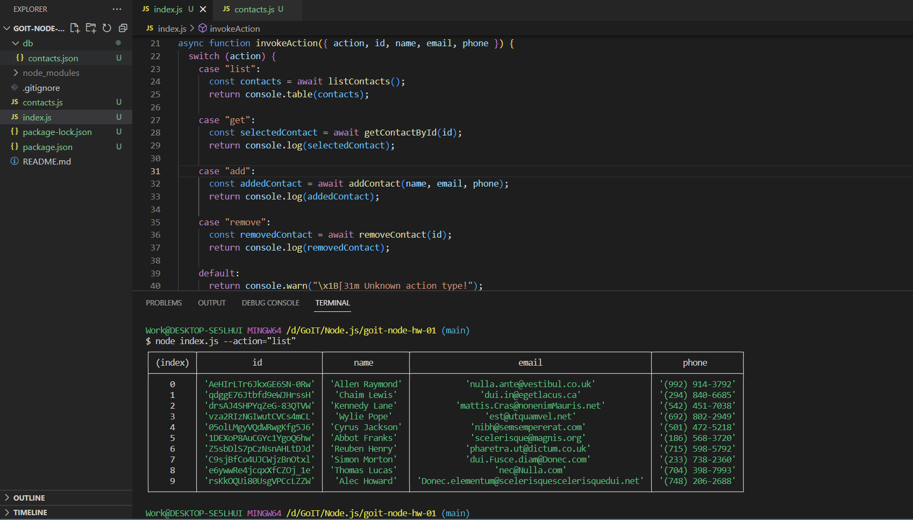
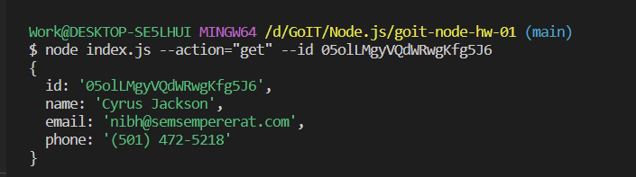
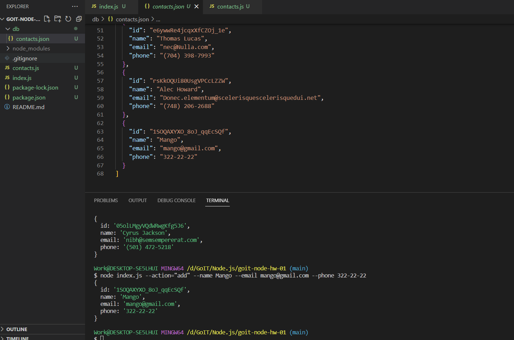
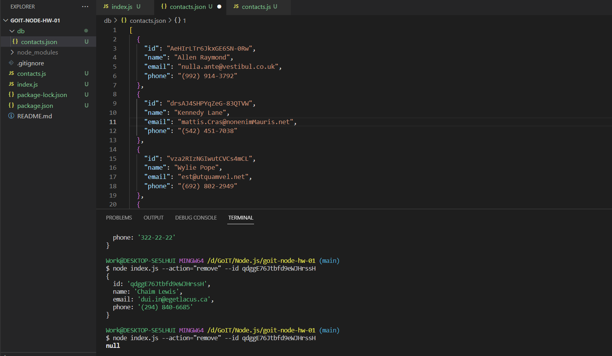

# goit-node-hw-01

--action="list" - getting all contacts

--action="get" - getting contact by ID

--action="add" - adding new contact to contact's list

--action="remove" - removing contact by ID from contact's list

